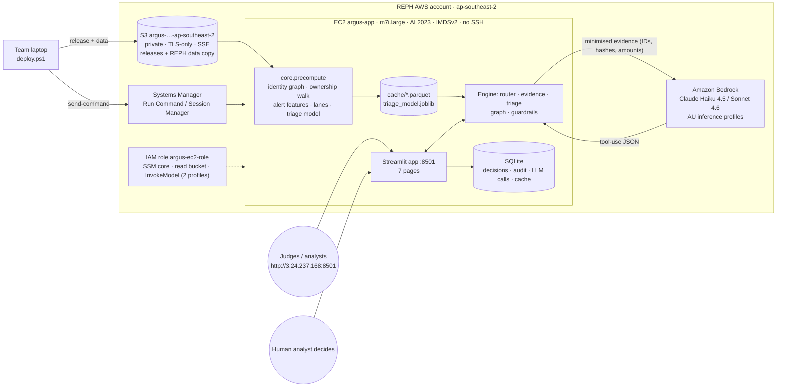

# ARGUS — Architecture

## Components

| Layer | Module | Responsibility |
|---|---|---|
| Data | `core/data.py` | DuckDB in-memory database with read-only views over `D_risk/*.parquet` and `cache/*.parquet`; one cursor per query (thread-safe under Streamlit). Raw finance cleaning: dedupe by primary key, 3 date formats, channel normalisation, orphan supplier IDs. |
| Precompute | `core/precompute.py` | Identity links → networkx connected components (clusters). Ownership exposure: DFS from each sanctions-listed entity along parent→child links, product of %, ≤4 hops, ≥10% floor, never revisits a node on the path (loop-safe), keeps the strongest path. Alert features **as of alert time** (devices first seen before the alert, watchlist listings before the alert, alerts closed before the alert, nominee links effective before the alert). Lanes. HistGradientBoosting triage model with out-of-time split. Supplier exposure. |
| Engine | `core/evidence.py`, `core/router.py`, `core/triage.py`, `core/graph.py` | Evidence pack for 13 record types; universal router (regex IDs, INV 6 vs 7 digits, fuzzy names, questions, JSON); new-transaction scoring from live data as of its timestamp; pyvis network and ownership graphs. |
| AI | `core/llm.py`, `core/guardrails.py` | Bedrock Converse with the verbatim system prompt, forced tool-use JSON schema (case / Q&A / memo), action definitions, temperature 0.2, `maxTokens` set, cache by prompt hash, per-session and daily caps, fallback model then labelled template. Data minimisation before sending; citation check on return. |
| Governance | `core/audit.py` | SQLite (WAL): decisions (AI suggestion vs human disposition, rationale, consolidated alerts, second approver, override flag), audit log, LLM call log (DATA-05), LLM cache. |
| UI | `app.py`, `pages/*`, `core/ui.py` | Streamlit navigation, access gate (optional code), case rendering with citation badge, decision form that blocks unverified citations. |

## Request flow: investigate `ALR0005789`

1. Router: `ALR\d{7}` → alert.
2. Evidence: alert features row (lane, score, reasons) → account `ACC…` → holder `IND…` → cluster CL00001 (15 identities) → shared links
   (4 fingerprints, 1 phone hash, 2 addresses) → 49 accounts → transactions (471, $3.92M, 96.8% member-to-member) → 137 alerts (30 rules,
   100 analysts, 72 closed FP) → 34 investigations (487 h) → watchlist hits (IND0057606 sanctions-like since 2020).
3. UI renders the subject card, network graph, money flow, ownership and alert history.
4. *Write case*: evidence minus replay-only fields → `guardrails.minimise` → Bedrock `converse(toolChoice=submit_case)` → JSON →
   `check_citations` (every ID must exist in the evidence) → render with badge → log call.
5. *Record decision*: analyst, disposition, rationale, consolidate 137 alerts → `decisions` + `audit_log`.

## Model and data choices

* **Labels:** `is_false_positive` on closed alerts (real hit = closed true positive, monitoring or escalated).
* **Split:** train on alerts created before 2026-01-01 (18,368), test on 2026 alerts (11,614). 2026 scores shown in the queue are out of time.
* **Excluded by design:** nationality, gender, date of birth / age, occupation, transaction country.
* **New transactions:** without a rule context the ML has no lift (AUC 0.50), so ARGUS combines signal likelihood ratios
  (P(signal | real) / P(signal | FP), learned from the same decisions). Sanctions exposure always means Critical / compliance review.

## Security

* No secrets in code or Git; Bedrock and S3 authorised by the instance role (least privilege: 2 inference profiles + their models, 1 bucket).
* IMDSv2 required; no inbound SSH (port 8501 only); administration through SSM.
* Private, TLS-only, encrypted S3 bucket; REPH data copied only inside the REPH AWS account; `.gitignore` excludes data, cache and databases.
* LLM output is untrusted text: never executed, citation-checked, schema-constrained; free text in evidence is quoted as data.
* Cost guard: 40 LLM calls per session and 800 per day; responses cached by prompt hash.
